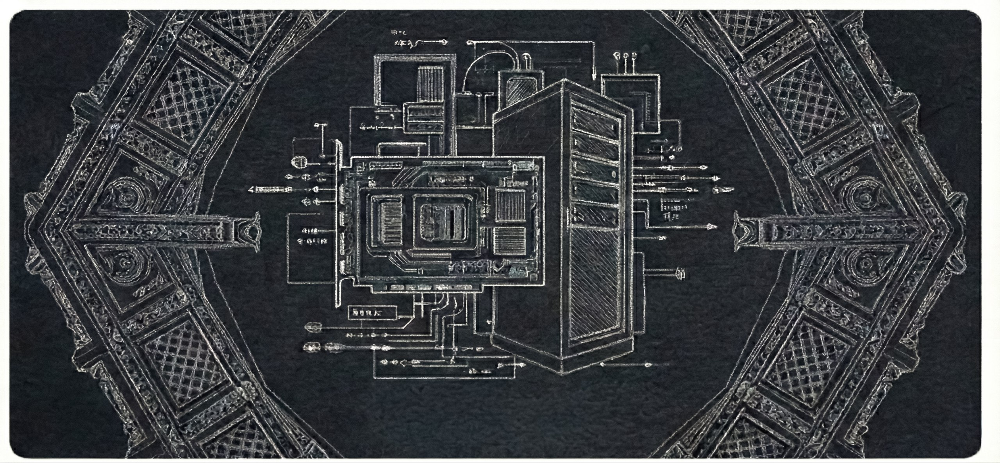

  

---

# Namaste, I'm Ritwik 👋

> *Breaking systems, building backends, and writing software somewhere in between.*

I'm a developer who loves figuring out how systems work under the hood. My interests span from tweaking my Arch Linux workspace to exploring the mechanics of backend architecture and parallel computing. I'm constantly learning, experimenting with new tools, and aiming to build software that is efficient, reliable, and thoughtfully designed.

---

### 🛠️ Currently Engineering

* **WarpKV:** Architecting a GPU-accelerated Key-Value store utilizing C++ and CUDA for extreme throughput.

---

### 🏛️ The Technical Arsenal

#### ⚙️ Systems & Core

#### 🗄️ Backend & Data

#### ☁️ Cloud & Infrastructure

---

### 🎮 Beyond the Terminal

When I'm not running local models through Ollama or debugging distributed systems on my MX130, you can find me:

* Unwinding with some gaming or catching up on a good movie or tv series.
* Picking one perfect track and letting autoplay do the rest.
* Getting a good run in or diving into a solid book.

---

  <h3>📊 GitHub Analytics</h3>

  
  
  
  
  

### 📬 Connect with Me

[LinkedIn](YOUR_LINKEDIN_URL) • [Instagram](YOUR_INSTAGRAM_URL) • [Email](mailto:ritwikg.0501@gmail.com)

